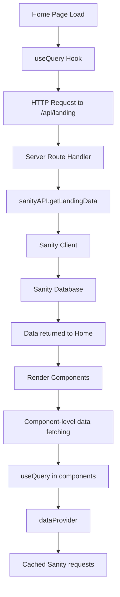

# Homepage Data Flow

## Overview
The homepage implements a multi-layered data fetching strategy with caching and deduplication to prevent duplicate data fetches.

## Data Flow Sequence

1. **Initial Page Load**
```typescript
// In home.tsx
const { data: landingData = {} as LandingPage, isLoading } = useQuery<LandingPage>({
  queryKey: ["/api/landing"],
});
```

2. **Server-side Route Handler**
```typescript
// In routes.ts
app.get("/api/landing", async (req, res) => {
  try {
    const landingData = await sanityAPI.getLandingData();
    res.json(landingData);
  } catch (error) {
    console.error("Error fetching landing data:", error);
    res.status(500).json({ message: "Error fetching landing data" });
  }
});
```

3. **Sanity API Layer**
```typescript
// In sanity.ts
export const sanityAPI = {
  getLandingData: async () => {
    try {
      return await client.fetch(queries.getLandingPage);
    } catch (error) {
      console.error('Error fetching landing data:', error);
      throw error;
    }
  }
};
```

4. **Data Provider Layer**
```typescript
// In dataProvider.ts
export const dataProvider = {
  getLandingPage: () => cachedFetch('landingPage', () => client.fetch(queries.getLandingPage)),
  // ...other methods
};
```

## Caching Strategy

1. **Client-side Cache (React Query)**
- Stale time: 5 minutes
- Cache time: 10 minutes
```typescript
useQuery({
  queryKey: ['letters'],
  queryFn: () => dataProvider.getLetters(),
  staleTime: 5 * 60 * 1000,
  cacheTime: 10 * 60 * 1000,
});
```

2. **Data Provider Cache**
```typescript
const CACHE_TTL = 5 * 60 * 1000; // 5 minutes

async function cachedFetch<T>(key: string, fetcher: () => Promise<T>): Promise<T> {
  const now = Date.now();
  const cached = cache.get(key) as CacheEntry<T> | undefined;
  
  if (cached && (now - cached.timestamp) < CACHE_TTL) {
    return cached.data;
  }
  
  const result = await fetcher();
  cache.set(key, { data: result, timestamp: now });
  return result;
}
```

3. **Request Deduplication**
```typescript
const inFlightRequests = new Map();

client.fetch = async (...args) => {
  const key = JSON.stringify(args);
  
  if (inFlightRequests.has(key)) {
    return inFlightRequests.get(key);
  }
  
  const promise = originalFetch(...args).finally(() => {
    inFlightRequests.delete(key);
  });
  
  inFlightRequests.set(key, promise);
  return promise;
};
```

## Component Level Data Flow



## Key Features

1. **Multi-level Caching**
   - React Query cache (client-side)
   - Data Provider cache (5 minutes TTL)
   - Sanity CDN cache (production)

2. **Error Handling**
   - Server-side error logging
   - Client-side fallback values
   - React Query error states

3. **Performance Optimizations**
   - Request deduplication
   - Cached responses
   - Stale-while-revalidate pattern
   - Component-level data fetching

4. **Data Flow Architecture**
   ```
   Client Request
   → React Query
   → Express Server
   → Sanity API
   → Sanity Database
   → Back through layers
   → Render in React
   ```

This architecture ensures:
- Efficient data loading
- Good performance
- Reliable error handling
- Clean separation of concerns
- Easy debugging (with request tracking)
- Optimal user experience
